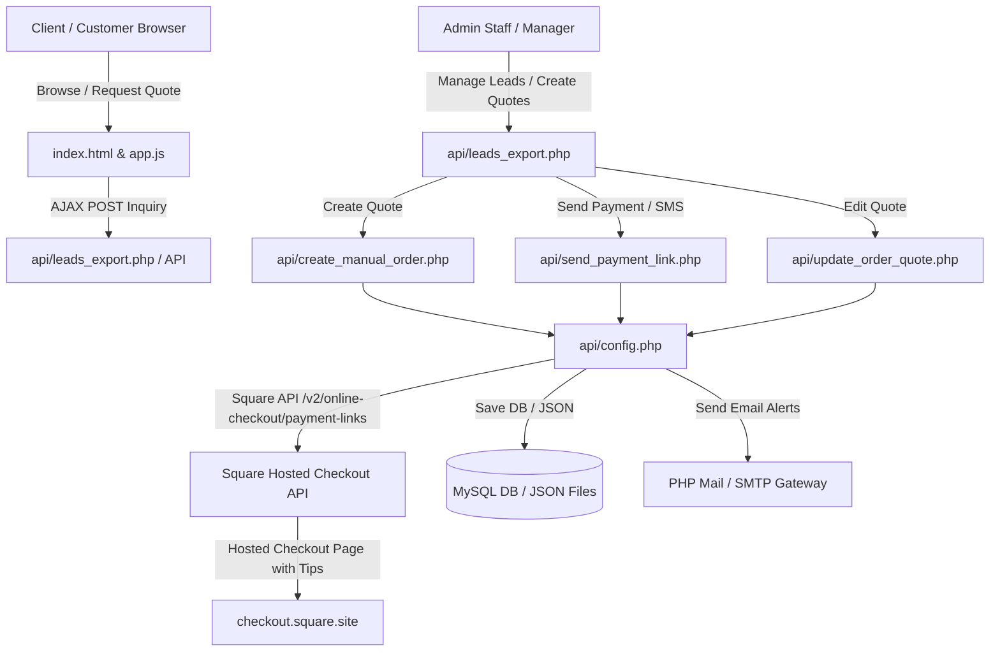
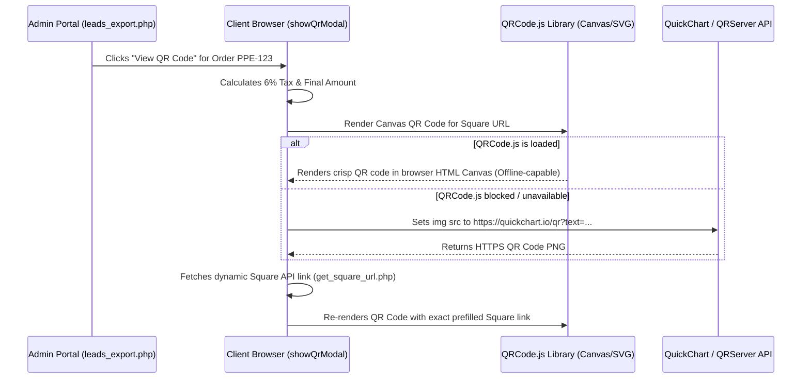

# 🌸 Petals Paradise Events - System Architecture & Code Flow Documentation

## 1. System Overview & Architecture Summary

**Petals Paradise Events** is a modern, high-performance web application designed for party rentals, event decor quotes, automated payment processing via Square, and lead management. The system is built with a lightweight, zero-dependency architecture that guarantees high speed, maximum reliability, and standalone operation.

### Tech Stack
* **Frontend**: Vanilla JavaScript (ES6+), HTML5, Custom CSS3 Design System (Glassmorphism, CSS variables, dark theme), responsive grid layouts.
* **Backend API**: PHP 7.4 - 8.3 RESTful API layer.
* **Payment Integration**: Square Online Checkout API (`/v2/online-checkout/payment-links`).
* **Database / Persistence**: Dual-layer persistence architecture:
  1. **Primary**: MySQL Database via PHP PDO (`leads` & `orders` tables).
  2. **Fallback**: Local JSON file storage (`leads.json` & `orders.json`) if MySQL is offline.
* **Email & Communications**: PHP `mail()` / SMTP notification system.
* **QR Code Engine**: Client-side `QRCode.js` (Canvas/SVG) with fallback to HTTPS QuickChart / QRServer APIs.

---

## 2. High-Level Architecture Diagram



---

## 3. Core Modules & Subsystems

### A. Core Backend Configuration (`api/config.php`)
* **Role**: Central configuration registry, database manager, Square API link generator, and secret reader.
* **Secrets Isolation**: Loads production credentials from `api/secrets.php` (gitignored). If `secrets.php` is missing, falls back to server environment variables or safe defaults.
* **Square API Link Generator (`generateSquarePaymentUrl`)**:
  - Accepts `$orderId` and `$finalTotalVal`.
  - Constructs a cURL request to `https://connect.squareup.com/v2/online-checkout/payment-links`.
  - Uses the Square **`order` object format** (with `location_id` and `line_items`) and sets `'allow_tipping' => true` in `checkout_options`.
  - Returns the generated hosted Square checkout link (e.g. `https://checkout.square.site/m/...`).

### B. Admin Dashboard Portal (`api/leads_export.php`)
* **Role**: Password-protected administrative control center.
* **Key Features**:
  - **Leads & Inquiries Tab**: View incoming customer web inquiries with expandable note modals (`Read Full Note`).
  - **Active Orders Tab**: Full order tracking with order status drop-down management (*Pending*, *Confirmed*, *Order Picked Up*, *Out for Delivery*, *Completed*, *Cancelled*).
  - **Manual Quote / Order Creator**: Full modal to select catalog items, add custom fees (delivery, setup, discount), live tax calculation (VA Sales Tax @ 6.0%), and issue immediate payment links.
  - **QR Code Modal**: Displays dynamic QR codes for any order to be scanned on mobile devices.

### C. Manual Order & Quote API (`api/create_manual_order.php`)
* **Role**: Handles phone orders or direct inquiry quotes submitted from the admin portal.
* **Financial Calculations**:
  $$\text{Base Total} = \text{Subtotal} - \text{Discount} + \text{Delivery Fee} + \text{Setup Fee}$$
  $$\text{VA Sales Tax (6\%)} = \text{round}(\text{Base Total} \times 0.06, 2)$$
  $$\text{Final Amount Due} = \text{Base Total} + \text{VA Sales Tax}$$
* **Outputs**: Saves the order to the database/JSON file, requests a dynamic Square payment URL from `generateSquarePaymentUrl()`, and sends an HTML quote email to the customer.

### D. Payment Link Dispatcher (`api/send_payment_link.php`)
* **Role**: Generates and sends payment links via Email and SMS for existing orders.
* **Features**: Formats professional HTML invoice tables including itemized subtotal, discount, 6.0% VA Sales Tax, and final amount due.

### E. Quote Update API (`api/update_order_quote.php`)
* **Role**: Allows admins to modify existing quotes, adjust line items or pricing, recalculate the 6.0% VA Sales Tax, and re-send updated payment links.

---

## 4. End-to-End Data Flows

### Flow 1: Customer Web Inquiry Flow
1. **User Action**: Customer selects party rental items (e.g. *Wedding Tent 16x26*, *Haldi Urli*, *Folding Chairs*) on `index.html`.
2. **Client Calculation**: `app.js` updates cart totals dynamically in real-time.
3. **Form Submission**: Customer submits their contact information, event date, and location.
4. **Backend Processing**: Submission is sent to the backend. The system formats the lead record, assigns a timestamp, and persists it into the database (`leads` table or `leads.json`).
5. **Instant Admin Alert**: `config.php` sends instant email notifications to `contact@petalsparadiseevents.com` and `biragonimounika@gmail.com`.

---

### Flow 2: Creating a Phone Order & Generating Square Payment Links with Tipping
1. **Admin Action**: Admin opens `leads_export.php`, clicks **🌸 Create New Quote / Order**, and selects catalog items.
2. **Live Math Execution**: As items or fee fields change, `recalcCreateModalSubtotal()` calculates:
   - Items Subtotal
   - Quote Base Total
   - **VA Sales Tax (6%):** `$baseTotal * 0.06`
   - **Final Amount Due:** `$baseTotal + $tax`
3. **API POST**: Admin clicks **Create Order & Send Email**. A POST payload is sent to `api/create_manual_order.php`.
4. **Square Checkout Creation**: `create_manual_order.php` calls `generateSquarePaymentUrl($orderId, $finalTotalVal)`:
   ```json
   {
     "idempotency_key": "ppe_ORDERID_TIMESTAMP",
     "order": {
       "location_id": "LV04RNB7PJKCA",
       "line_items": [
         {
           "name": "Petals Paradise Events - Order #PPE-2026...",
           "quantity": "1",
           "base_price_money": { "amount": 20651, "currency": "USD" }
         }
       ]
     },
     "checkout_options": {
       "allow_tipping": true,
       "redirect_url": "https://petalsparadiseevents.com/#confirmation"
     }
   }
   ```
5. **Hosted Checkout Page**: Square returns a unique URL (`https://checkout.square.site/m/...`). When opened by the customer, Square displays the total amount and renders the **Tip Selection Box** (15%, 18%, 20%, or Custom Tip).

---

### Flow 3: QR Code Generator Execution Flow


---

## 5. Database Schema Specification

### `leads` Table
| Column Name | Data Type | Description |
| :--- | :--- | :--- |
| `id` | `VARCHAR(64)` **PRIMARY KEY** | Unique lead ID or timestamp identifier |
| `date_added` | `DATETIME` | Time inquiry was submitted (US Eastern Time) |
| `name` | `VARCHAR(255)` | Customer full name |
| `email` | `VARCHAR(255)` | Customer email address |
| `phone` | `VARCHAR(64)` | Customer phone number |
| `event_type` | `VARCHAR(128)` | Type of event (Wedding, Haldi, Birthday, etc.) |
| `service_tier` | `VARCHAR(128)` | Rental tier or package selected |
| `guest_count` | `VARCHAR(64)` | Estimated guest count |
| `budget` | `VARCHAR(64)` | Estimated budget |
| `event_date` | `VARCHAR(64)` | Requested event date |
| `location` | `TEXT` | Venue address or city |
| `source` | `VARCHAR(128)` | Website, Phone, Instagram, etc. |
| `notes` | `TEXT` | Customer or inquiry notes |

### `orders` Table
| Column Name | Data Type | Description |
| :--- | :--- | :--- |
| `id` | `VARCHAR(64)` **PRIMARY KEY** | Unique Order ID (e.g. `PPE-20260914-839`) |
| `date_added` | `DATETIME` | Order creation timestamp (US Eastern Time) |
| `name` | `VARCHAR(255)` | Customer full name |
| `email` | `VARCHAR(255)` | Customer email address |
| `phone` | `VARCHAR(64)` | Customer phone number |
| `event_date` | `VARCHAR(64)` | Event date |
| `venue_location` | `VARCHAR(255)` | Venue address / city |
| `fulfillment_method` | `VARCHAR(64)` | `Pickup` or `Delivery` |
| `delivery_address` | `TEXT` | Full delivery address (if Delivery selected) |
| `items` | `TEXT` (JSON) | JSON array of line items `[{name, qty, price, total}]` |
| `subtotal` | `DECIMAL(10,2)` | Raw items subtotal |
| `discount` | `DECIMAL(10,2)` | Discount amount |
| `delivery_fee` | `DECIMAL(10,2)` | Delivery fee |
| `setup_fee` | `DECIMAL(10,2)` | Setup fee |
| `total` | `DECIMAL(10,2)` | Base order total (before tax) |
| `status` | `VARCHAR(64)` | `Pending`, `Confirmed`, `Out for Delivery`, `Completed` |
| `payment_method` | `VARCHAR(128)` | `Square Online`, `Unpaid`, `Cash`, `Zelle` |
| `admin_notes` | `TEXT` | Internal admin notes |

---

## 6. Security & Confidentiality

> [!IMPORTANT]
> **Confidentiality Notice**: This file contains sensitive architectural information about your website. Do not publish this file publicly.

* **Secrets Storage**: Server secrets (API tokens, database passwords, admin credentials) are stored in `api/secrets.php`, which is excluded from version control via `.gitignore`.
* **Admin Authentication**: Admin authentication relies on a secure SHA-256 session cookie (`md5($adminUser . $adminPass . $adminSecret)`).
* **Anti-Caching Headers**: `api/leads_export.php` enforces `Cache-Control: no-store, no-cache, must-revalidate` and `X-Frame-Options: DENY` to prevent unauthorized browser caching of lead or order data.
